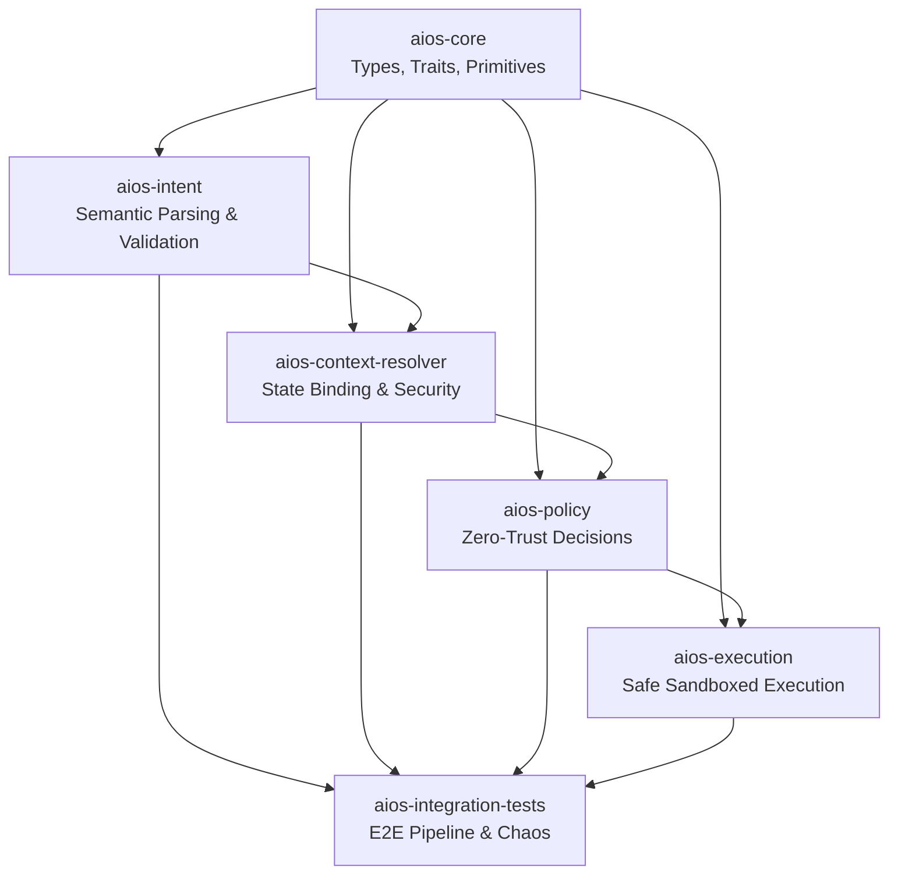

<p align="center">
  
</p>

<p align="center">
  <em>Deterministic, security-first, zero-trust execution environment for LLM-generated actions</em>
</p>

<p align="center">
  <a href="#overview">Overview</a> •
  <a href="#architecture">Architecture</a> •
  <a href="#the-pipeline">Pipeline</a> •
  <a href="#security-mandate">Security</a> •
  <a href="#getting-started">Getting Started</a> •
  <a href="#contributing">Contributing</a> •
  <a href="#sponsorship">Sponsorship</a>
</p>

---

## Overview

AIOS (Artificial Intelligence Operating System) is a **deterministic, security-first, zero-trust execution environment** designed specifically to sandbox, validate, and execute actions generated by Large Language Models (LLMs) or autonomous agents.

Unlike traditional operating systems that rely on identity-based access control, AIOS treats the LLM (the "Agent") as a fundamentally **untrusted entity** capable of generating hallucinated, malicious, or poorly-formed instructions. AIOS sits between the LLM's brain and the host system, ensuring absolute containment and deterministic execution.

Every action from an LLM must run a **gauntlet through five hardened layers** before it ever touches the host system:

```
LLM Output  →  Intent Parsing  →  Context Resolution  →  Policy Evaluation  →  Sandboxed Execution  →  Host
     ↑              ↑                    ↑                      ↑                      ↑
     │     [aios-intent]    [aios-context-resolver]    [aios-policy]       [aios-execution]
     │
     └──── All layers share types & primitives from [aios-core]
```

---

## Architecture

### Crate Dependency Graph



### Full Pipeline Flow

```mermaid
graph TB
    subgraph "1. Intent Layer (aios-intent)"
        A1[Raw LLM JSON] --> A2[Deserialization<br/>Strict / deny_unknown_fields]
        A2 --> A3[Structural Validation<br/>Size limits, empty fields]
        A3 --> A4[Semantic Validation<br/>Path traversal, logic bounds]
        A4 --> A5[Intent Translation<br/>Map to typed Action enum]
    end

    subgraph "2. Context Resolver (aios-context-resolver)"
        B1[Confidence & Thresholds] --> B2[Injection Scanning]
        B2 --> B3[Agent History & Loop Detection]
        B3 --> B4[Namespace & Allowed Zone]
        B4 --> B5[Path Resolution via FD<br/>TOCTOU mitigation]
        B5 --> B6[Resource Population]
        B6 --> B7[Cryptographic Verification<br/>Plugin signatures]
        B7 --> B8[Permission Caching<br/>With FS watcher eviction]
    end

    subgraph "3. Policy Engine (aios-policy)"
        C1[Capability Check<br/>3-level hierarchy] --> C2[Forbidden Rules<br/>System-critical blacklist]
        C2 --> C3[Risk Computation<br/>MAX model - 6 factors]
        C3 --> C4[Rate Limiting<br/>Sliding window ring buffer]
        C4 --> C5[Policy Rules<br/>Priority-based JSON rules]
        C5 --> C6[Final Decision<br/>Unforgeable VerifiedPolicyDecision]
    end

    subgraph "4. Executor (aios-execution)"
        D1[Policy Verdict Check] --> D2[Resource Lock Acquisition<br/>RAII-based]
        D2 --> D3[Confirmation Gate]
        D3 --> D4[Dry Run Gate]
        D4 --> D5[Pre-Execution Snapshot]
        D5 --> D6[Sandbox Dispatch<br/>WASM / Firecracker / gVisor]
        D6 --> D7[Outcome Verification]
        D7 --> D8[Output Sanitization<br/>Injection redaction]
        D8 --> D9[Tamper-Proof Audit<br/>HMAC-SHA256 chain]
        D9 --> D10[Release Lock & Return]
    end

    A5 --> B1
    B8 --> C1
    C6 --> D1
```



---

## The Pipeline

### Layer 1: `aios-intent` — The Semantic Gatekeeper

The bridge between the probabilistic LLM and the deterministic OS. It parses JSON payloads, validates schema compliance, limits payload sizes, prevents JSON-based injection attacks, and maps semantic strings to hardened Rust enums.

**Key responsibilities:**
- **Act vs. Answer**: Determines if the output requires a system action or a simple linguistic response (`AgentOutput::Action` vs `AgentOutput::Response` vs `AgentOutput::Clarification`)
- **Normalization**: Translates various linguistic "flavors" of the same command into a single, type-safe `Intent` variant
- **Pre-Action Validation**: Path traversal protection, size constraints (10KB plugin payload cap), strict schema enforcement with `#[serde(deny_unknown_fields)]`
- **Robust Parsing**: Retry loops allow sending correction prompts back to the LLM for malformed JSON

### Layer 2: `aios-context-resolver` — State & Security

The Policy Engine cannot make security decisions based on abstract concepts like "delete `../../etc/passwd`". It requires concrete context. The Context Resolver transforms an `Action` into a `ResolvedAction`.

**Key responsibilities:**
- **TOCTOU Prevention**: Uses `nix::openat` and `/proc/self/fd/N` resolution instead of `fs::canonicalize()` to eliminate symlink races
- **Injection Scanning**: Detects prompt injection indicators in plugin outputs
- **Agent History**: Short-term interaction tracking to detect spam/loop patterns
- **Cryptographic Verification**: Plugin action signatures are validated against a trusted signer allowlist
- **Permission Caching**: In-memory cache with `notify`-based filesystem watchers for automatic eviction

### Layer 3: `aios-policy` — Zero-Trust Brain

Takes a fully resolved action with its environment context and evaluates it against deterministic rules.

**6-Step Evaluation Pipeline:**
1. **Capability Check**: 3-level hierarchy (Action ⊂ Namespace ⊂ Global)
2. **Forbidden Rules**: Hard-blocks system-critical paths (`/etc`, `/bin`, raw devices)
3. **Risk Computation**: MAX model across 6 factors (base risk, sensitivity, trust, etc.)
4. **Rate Limiting**: Sliding window via memory-safe ring buffer — O(1) insert, no heap growth
5. **Policy Rules**: JSON-defined rules with priority-based matching (Deny wins ties)
6. **Final Decision**: Produces an unforgeable `VerifiedPolicyDecision` token

### Layer 4: `aios-execution` — Safe Actuation

The **only** crate with the authority to mutate host state. It consumes the `VerifiedPolicyDecision` token and orchestrates safe execution.

**10-Step Execution Pipeline:**
1. Policy Verdict & Capability Check
2. Resource Lock Acquisition (RAII-based, prevents idempotency races)
3. Confirmation Gate (user approval for high-risk actions)
4. Dry Run Gate (preview without side effects)
5. Pre-Execution Snapshot (state capture for rollback)
6. Sandbox Dispatch with Hard Timeout (WASM / Firecracker / gVisor)
7. Outcome Verification (compare result against expected boundaries)
8. Output Sanitization (redact prompt injection, role hijacks from stdout/stderr)
9. Tamper-Proof Audit Emission (SHA-256 backward chain + HMAC-SHA256 signature)
10. Release Lock & Return

### Foundation: `aios-core` — Shared Types & Primitives

The foundational library housing the domain model:

| Module | Contents |
|---|---|
| `action` | `Action`, `CoreAction`, `SecurePluginAction`, `ForbiddenActionKind` |
| `params` | Strongly-typed parameter structs for built-in actions |
| `capability` | `Capability` — granular definitions (`FileDelete`, `PluginExecuteAll`, etc.) |
| `resource` | `Resource`, `ResourceType` — typed mappings (`File`, `Device`, `Directory`) |
| `risk` | `RiskLevel` — Low / Medium / High / Critical |
| `policy` | `PolicyDecision`, `PolicyVerdict`, `PolicyContext`, `RateLimit` |
| `metadata` | `ActionMetadata`, `ActionFingerprint` — provenance and history typing |
| `audit` | `AuditRecord`, `AuditOutcome` — append-only validation traces |
| `validation` | `Validate` trait — ensures payload integrity before inference escapes |

---

## Security Mandate

AIOS is built under a strict security mandate:

- **Fail-Closed**: Any anomaly, timeout, or unrecognized state results in immediate denial
- **Unforgeable Tokens**: System execution requires a cryptographic or strictly type-enforced token representing policy approval. The execution engine cannot be called directly
- **No Symlink Races**: All filesystem operations use file-descriptor-based paths (`openat`, `/proc/self/fd/N`) to eliminate TOCTOU vulnerabilities
- **Stateless Verification**: Every action is evaluated independently on its own merits, though short-term history is kept strictly for anti-spam
- **Strict Capabilities**: Agents must possess the specific capability (`fs:read`, `net:connect`, `sys:reboot`) required for the action
- **Default Deny**: Implicit structural failures trigger typed denial responses — no unexpected fall-through
- **Panic Isolation**: Executor threads use `catch_unwind` and `AssertUnwindSafe` to prevent crash propagation
- **Two-Phase Crash Recovery**: `PREPARE → EXECUTE → VERIFY → COMMIT` journal with automatic rollback on restart

---

## Getting Started

### Prerequisites

- Rust 1.75+ (edition 2021)
- Cargo (included with Rust)
- For Unix environments: `inotify` (Linux) or `kqueue` (macOS) for optimal cache invalidation

### Build

```bash
# Build all crates
cargo build --workspace

# Run the full test suite
cargo test --workspace

# Run security-specific tests
cargo test attack_simulation --workspace

# Run chaos tests
cargo test chaos_tests --workspace
```

### Check

```bash
cargo check --workspace
cargo clippy --workspace
```

### Docker

```bash
docker build -t aios .
docker run --rm aios
```

---

## Project Structure

```
aios/
├── aios_core/                  # Foundational types, traits, primitives
│   ├── src/
│   │   ├── action.rs           # Action, CoreAction, SecurePluginAction
│   │   ├── capability.rs       # Capability granular definitions
│   │   ├── params.rs           # Strongly-typed parameter structs
│   │   ├── resource.rs         # Resource, ResourceType
│   │   ├── risk.rs             # RiskLevel
│   │   ├── policy.rs           # PolicyDecision, PolicyVerdict
│   │   ├── metadata.rs         # ActionMetadata, ActionFingerprint
│   │   ├── audit.rs            # AuditRecord, AuditOutcome
│   │   ├── validation.rs       # Validate trait
│   │   └── error.rs            # AiosError
│   └── Cargo.toml
│
├── aios_intent/                # Semantic parsing & validation
│   ├── src/
│   │   ├── intent.rs           # Intent types & normalization
│   │   ├── pipeline.rs         # Parsing pipeline with retry logic
│   │   └── lib.rs
│   └── Cargo.toml
│
├── aios_context_resolver/      # State binding & security
│   ├── src/
│   │   ├── resolver.rs         # 8-step resolution pipeline
│   │   ├── confidence.rs       # Confidence scoring & thresholds
│   │   ├── injection.rs        # Prompt injection detection
│   │   ├── cache.rs            # Permission caching with FS watchers
│   │   ├── path/               # FD-based path resolution
│   │   ├── plugin/             # Cryptographic plugin verification
│   │   ├── history/            # Agent history & loop detection
│   │   └── types/              # ResolvedAction, ResourceState
│   └── Cargo.toml
│
├── aios_policy/                # Zero-trust policy engine
│   ├── src/
│   │   ├── engine.rs           # 6-step evaluation pipeline
│   │   ├── capability.rs       # 3-level capability hierarchy
│   │   ├── forbidden.rs        # System-critical blacklist
│   │   ├── risk.rs             # MAX-model risk computation
│   │   ├── rate_limit.rs       # Sliding window ring buffer
│   │   ├── history.rs          # HistoryRing buffer
│   │   ├── verified.rs         # VerifiedPolicyDecision typestate
│   │   ├── audit.rs            # Policy audit logging
│   │   └── rules/              # JSON policy rules engine
│   └── Cargo.toml
│
├── aios_execution/             # Sandboxed safe execution
│   ├── src/
│   │   ├── executor.rs         # 10-step execution pipeline
│   │   ├── sandbox/            # WASM, Firecracker, gVisor adapters
│   │   ├── journal.rs          # Two-phase crash recovery journal
│   │   ├── idempotency.rs      # In-flight deduplication
│   │   ├── lock.rs             # RAII resource locks
│   │   ├── sanitizer.rs        # Output injection redaction
│   │   ├── verifier.rs         # Outcome verification
│   │   ├── rollback.rs         # State rollback
│   │   ├── timeout.rs          # Hard timeout enforcement
│   │   ├── audit.rs            # Tamper-proof HMAC audit chain
│   │   ├── capability.rs       # Defense-in-depth capability check
│   │   └── metrics.rs          # Observability counters
│   └── Cargo.toml
│
├── aios_integration_tests/     # E2E pipeline & chaos tests
│   ├── tests/
│   │   ├── pipeline_tests.rs   # End-to-end pipeline validation
│   │   ├── attack_simulation.rs# Security attack scenarios
│   │   ├── chaos_tests.rs      # Crash recovery & fault injection
│   │   └── common.rs           # Shared test utilities
│   └── Cargo.toml
│
├── Cargo.toml                  # Workspace definition
├── Cargo.lock
├── Dockerfile
├── banner.png                  # Project banner
├── LICENSE                     # MIT License
└── CONTRIBUTING.md             # Contribution guide
```

---

## Observability

AIOS provides structured observability across all layers:

| Layer | Metrics | Audit |
|---|---|---|
| Intent | `intent.parse.success/failure`, `intent.validation.failure`, `intent.retry.*` | Request tracing via UUID propagation |
| Context Resolver | `resolver.*` counters | ResolvedAction with full context snapshot |
| Policy | `policy.allow`, `policy.deny` (tagged by agent & rule) | Structured entries with verdict, rule name, duration |
| Execution | Execution latency, sandbox metrics | SHA-256 backward-chained, HMAC-SHA256 signed entries |

---

## Sponsorship

AIOS is an open-source project built in the open. If you find this project valuable for your infrastructure, research, or product, please consider supporting its development.

**Ways to sponsor:**
- **GitHub Sponsors**: [github.com/sponsors/aios-project](https://github.com/sponsors/aios-project)
- **Open Collective**: [opencollective.com/aios](https://opencollective.com/aios)

Sponsorship helps fund:
- Security audits and formal verification
- Additional sandbox runtime support (WASM, Firecracker, gVisor, Youki)
- Developer tooling and CI infrastructure
- Community documentation and examples

---

## License

This project is licensed under the MIT License — see the [LICENSE](LICENSE) file for details.

---

<p align="center">
  <strong>Built with ❤️ for a future where AI acts safely on behalf of humans.</strong>
</p>
