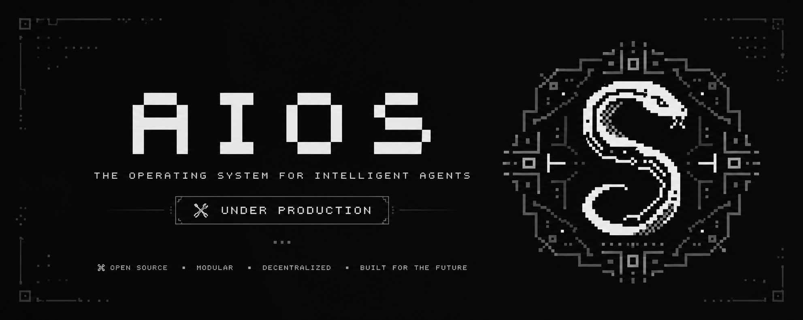
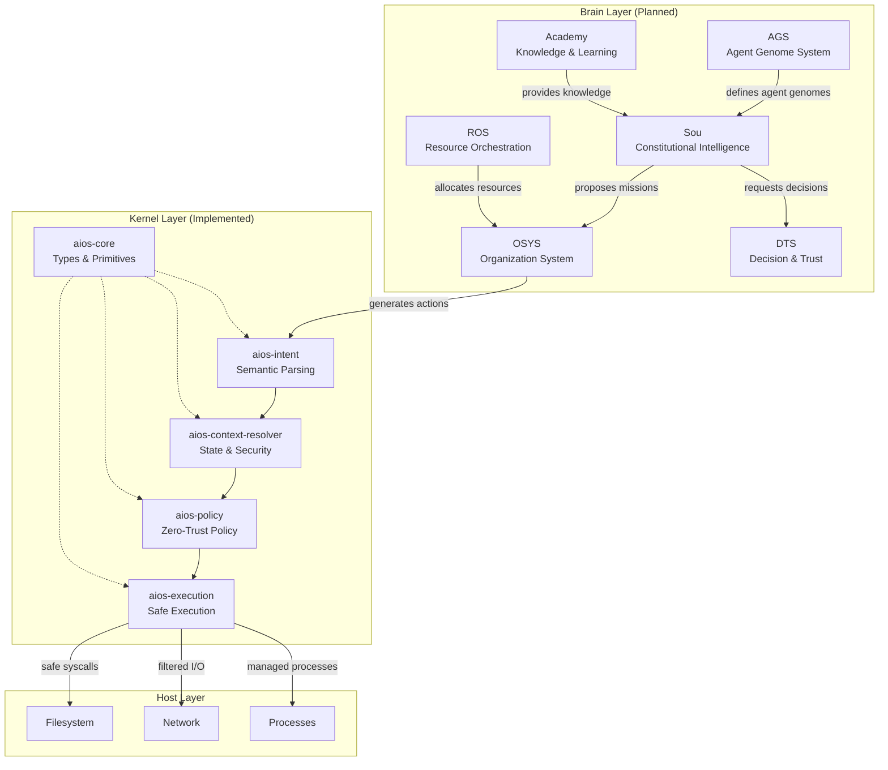
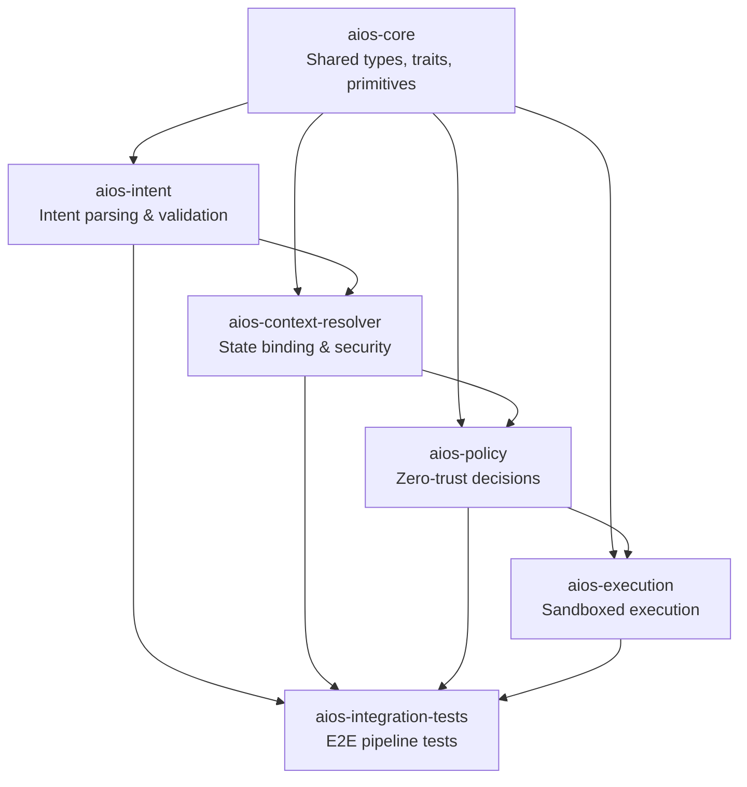
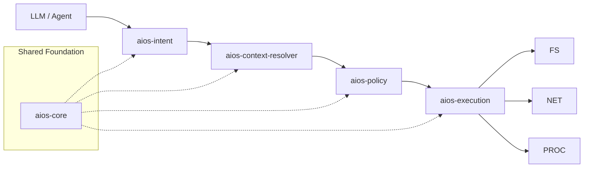
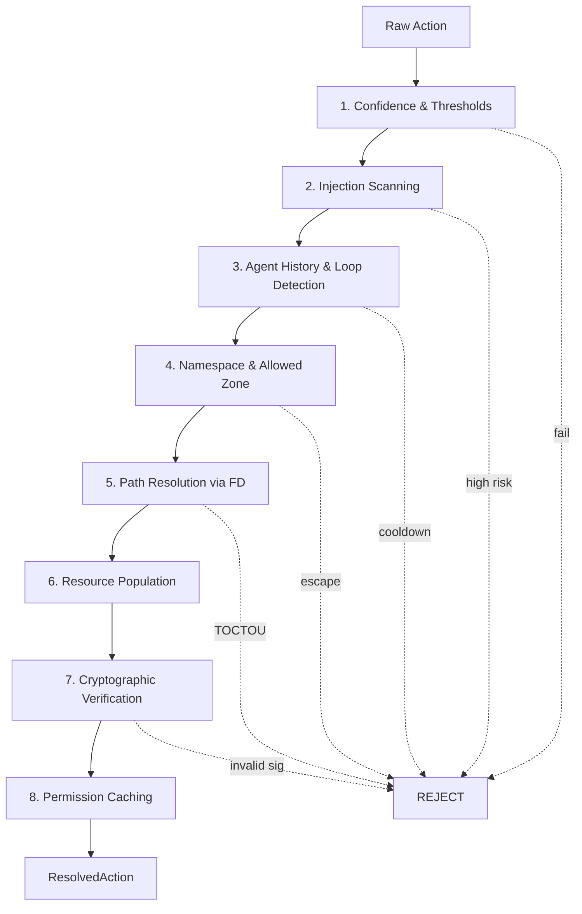
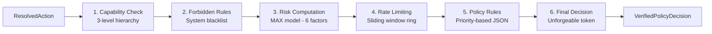
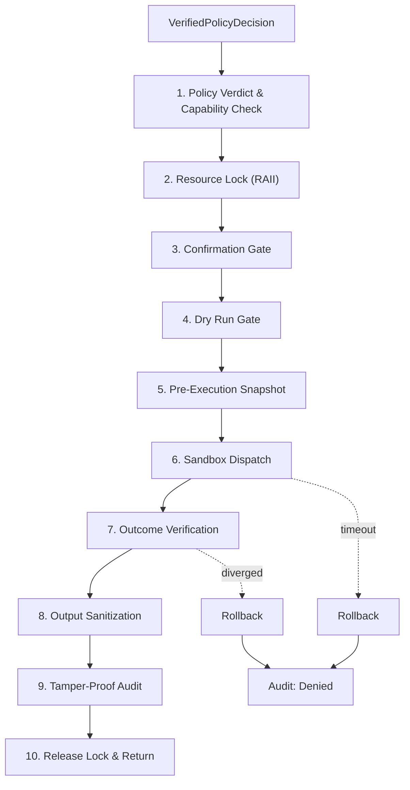

<p align="center">
  
</p>

<p align="center">
  <em>Constitutional intelligence for autonomous AI agents — a deterministic, zero-trust operating system for LLM-generated actions</em>
</p>

<p align="center">
  <a href="#overview">Overview</a> •
  <a href="#architecture">Architecture</a> •
  <a href="#kernel-pipeline">Kernel Pipeline</a> •
  <a href="#higher-level-systems">Higher-Level Systems</a> •
  <a href="#security-mandate">Security</a> •
  <a href="#getting-started">Getting Started</a> •
  <a href="#project-structure">Structure</a> •
  <a href="#license">License</a>
</p>

---

## Overview

AIOS (Artificial Intelligence Operating System) is a **constitutional operating system for autonomous AI agents**. It provides a complete stack from kernel-level security enforcement to high-level strategic intelligence, enabling LLMs and autonomous agents to act safely, deterministically, and accountably.

The system has two tiers:

| Tier | Layer | Purpose |
|------|-------|---------|
| **Kernel** (current) | aios-core, aios-intent, aios-context-resolver, aios-policy, aios-execution | Deterministic sandbox, validation, and execution of LLM actions |
| **Brain** (planned) | Sou, OSYS, DTS, AGS, ROS, Academy | Constitutional intelligence, organization, decision-making, and learning |

Unlike traditional operating systems that rely on identity-based access control, AIOS treats every LLM (the "Agent") as a fundamentally **untrusted entity** capable of generating hallucinated, malicious, or poorly-formed instructions. The kernel enforces **zero-trust containment**; the brain provides **constitutional governance**.

---

## Architecture

### Full System Map



### Current Crate Dependency Graph



---

## Kernel Pipeline

Every action from an LLM must run a gauntlet through four hardened layers before touching the host system.



### Layer 1: aios-intent — Semantic Gatekeeper

Parses raw LLM JSON output into deterministic, type-safe Action enums.

```
LLM JSON
  |
  v
1. Deserialization -- strict, deny unknown fields
  |
  v
2. Structural validation -- empty fields, size limits
  |
  v
3. Semantic validation -- path traversal, logic bounds
  |
  v
4. Intent translation -- map to typed Action enum
  |
  v
Action (aios-core)
```

**Key capabilities:**
- **Act vs. Answer**: Distinguishes system actions from linguistic responses (`AgentOutput::Action` / `Response` / `Clarification`)
- **Normalization**: Maps different phrasings of the same intent into a single type-safe variant
- **Robust Parsing**: Retry loops send correction prompts back to the LLM for malformed JSON
- **Size Constraints**: Plugin payloads capped at 10KB to prevent resource exhaustion

### Layer 2: aios-context-resolver — State & Security

Transforms abstract `Action` objects into fully resolved `ResolvedAction` with concrete system context.



**Security mechanisms:**
- **TOCTOU Prevention**: Uses `nix::openat` and `/proc/self/fd/N` instead of `fs::canonicalize()` to eliminate symlink races
- **HMAC Config Verification**: Ensures TOML configuration files have not been tampered with
- **Fail-Closed Cryptography**: Plugin actions denied if signature is missing, invalid, or untrusted
- **In-Memory Caching**: DashMap-based permission cache with `notify` filesystem watchers for automatic eviction

### Layer 3: aios-policy — Zero-Trust Brain

Evaluates resolved actions against deterministic rules to produce an unforgeable `VerifiedPolicyDecision`.



**6-Step Pipeline:**
1. **Capability Check**: 3-level hierarchy (Action, Namespace, Global)
2. **Forbidden Rules**: Hard-blocks system-critical paths (`/etc`, `/bin`, raw devices)
3. **Risk Computation**: MAX model across 6 factors (base risk, sensitivity, trust, history, safety, destructiveness)
4. **Rate Limiting**: O(1) sliding window ring buffer — no heap growth, memory safe
5. **Policy Rules**: JSON-defined rules with priority-based matching; Deny wins ties
6. **Final Decision**: Produces `VerifiedPolicyDecision` — constructor is `pub(crate)`, preventing external forgery

### Layer 4: aios-execution — Safe Actuation

The **only** crate with authority to mutate host state. Consumes the `VerifiedPolicyDecision` and orchestrates safe, audited execution.



**10-Step Pipeline:**
1. Policy Verdict & Capability Check — defense-in-depth
2. Resource Lock (RAII) — prevents idempotency races
3. Confirmation Gate — user approval for high-risk actions
4. Dry Run Gate — preview without side effects
5. Pre-Execution Snapshot — state capture for rollback
6. Sandbox Dispatch — WASM / Firecracker / gVisor
7. Outcome Verification — compare against expected boundaries
8. Output Sanitization — redact prompt injection, role hijacks
9. Tamper-Proof Audit — SHA-256 chain + HMAC-SHA256 signature
10. Release Lock & Return

### Foundation: aios-core — Shared Types & Primitives

Zero-dependency foundation crate (no async, no execution, no AI logic).

| Module | Contents |
|--------|----------|
| `action` | `Action`, `CoreAction`, `SecurePluginAction`, `ForbiddenActionKind` |
| `params` | Strongly-typed parameter structs for built-in actions |
| `capability` | `Capability` — `FileDelete`, `PluginExecuteAll`, etc. |
| `resource` | `Resource`, `ResourceType` — `File`, `Device`, `Directory` |
| `risk` | `RiskLevel` — Low / Medium / High / Critical |
| `policy` | `PolicyDecision`, `PolicyVerdict`, `PolicyContext`, `RateLimit` |
| `metadata` | `ActionMetadata`, `ActionFingerprint` — provenance and history |
| `audit` | `AuditRecord`, `AuditOutcome` — append-only validation traces |
| `validation` | `Validate` trait — payload integrity before inference escape |
| `error` | `AiosError` — structured, cascading error states |

---

## Higher-Level Systems

The AIOS kernel provides deterministic action execution. Above the kernel, the **Brain** layer provides constitutional intelligence for autonomous operation. These systems are specified in the [AIOS Bible](https://github.com/Nciibi/AIOS-DOCS) and represent the architectural vision for full AI autonomy.

### Sou — Constitutional Intelligence

Sou is the **single constitutional intelligence** of AIOS. It has identity, personality, goals, and executive authority. Sou reasons about situations, plans missions, learns from outcomes, and maintains constitutional memory.

- **Reasoning**: Evaluates situations, explores options, produces strategic proposals
- **Planning**: Transforms goals into mission plans with milestones and dependencies
- **Learning**: Distills experience into knowledge via the Academy
- **Delegation**: Creates missions and assigns workers through OSYS

Sou is bound by the **Law of Non-Execution** — it proposes, it does not execute.

### OSYS — Organization System

The administrative backbone of AIOS. Manages Organization entities — their creation, lifecycle, structure, and dissolution.

- Every Worker, Mission, and resource belongs to an Organization
- Organizations own missions, employ workers, and manage resource budgets
- Provides the constitutional unit of collective action

### DTS — Decision & Trust System

Evaluates decisions and assesses trust. Answers two questions:

1. **"How confident are we that this decision is correct?"** — confidence scoring against past evidence
2. **"Can this entity be trusted to execute this action?"** — trust assessment based on provenance and history

### AGS — Agent Genome System

Manages entity templates called **Genomes**. Every AIOS entity is instantiated from a Genome that defines capabilities, bounds, policies, and provenance. A Genome is the constitutional DNA of an entity.

- Creates, validates, composes, signs, and versions Genomes
- Enforces capability bounds at the template level
- Supports inheritance and composition for complex agent definitions

### ROS — Resource Orchestration Service

The constitutional authority on resource availability. Every computational resource — tokens, memory, compute, storage, energy — is registered, allocated, tracked, and accounted for.

- No capability executes without ROS verifying resource availability
- Supports budgets, quotas, reservations, and cost tracking
- Provider SDK for extensible resource backends

### Academy — Knowledge & Learning

Transforms raw evidence (Events) into structured, validated, distributable knowledge. Embodies evidence-driven operations — every piece of knowledge is derived from verifiable evidence.

- **Knowledge Management System (KMS)**: Structured knowledge storage
- **Knowledge Graph**: Relationships between knowledge entities
- **Validation Pipeline**: Verifies knowledge before distribution
- **SDK & API**: Programmatic access for agents and external systems

---

## Security Mandate

AIOS is built under a strict security mandate that applies across both kernel and brain layers:

- **Fail-Closed**: Any anomaly, timeout, or unrecognized state results in immediate denial
- **Unforgeable Tokens**: System execution requires a cryptographic or strictly type-enforced token. The execution engine cannot be called directly
- **No Symlink Races**: All filesystem operations use file-descriptor-based paths (`openat`, `/proc/self/fd/N`)
- **Stateless Verification**: Every action evaluated independently on its own merits
- **Strict Capabilities**: Agents must possess the specific capability (`fs:read`, `net:connect`, `sys:reboot`) for each action
- **Default Deny**: Implicit structural failures trigger typed denial — no unexpected fall-through
- **Panic Isolation**: Executor threads use `catch_unwind` / `AssertUnwindSafe`
- **Two-Phase Crash Recovery**: `PREPARE -> EXECUTE -> VERIFY -> COMMIT` journal with automatic rollback

---

## Getting Started

### Prerequisites

- Rust 1.75+ (edition 2021)
- Unix recommended for `inotify` / `kqueue` filesystem notifications

### Build & Test

```bash
cargo build --workspace
cargo test --workspace
cargo clippy --workspace
```

### Docker

```bash
docker build -t aios .
docker run --rm aios
```

### Security Tests

```bash
cargo test attack_simulation --workspace
cargo test chaos_tests --workspace
```

---

## Project Structure

```
aios/
+-- aios_core/                  # Foundation: types, traits, primitives
|   +-- action.rs               # Action, CoreAction, SecurePluginAction
|   +-- capability.rs           # Capability granular definitions
|   +-- params.rs               # Strongly-typed parameter structs
|   +-- resource.rs             # Resource, ResourceType
|   +-- risk.rs                 # RiskLevel
|   +-- policy.rs               # PolicyDecision, PolicyVerdict
|   +-- metadata.rs             # ActionMetadata, ActionFingerprint
|   +-- audit.rs                # AuditRecord, AuditOutcome
|   +-- validation.rs           # Validate trait
|   +-- error.rs                # AiosError
|
+-- aios_intent/                # Semantic parsing & validation
|   +-- intent.rs               # Intent types & normalization
|   +-- pipeline.rs             # Parsing pipeline with retry
|
+-- aios_context_resolver/      # State binding & security
|   +-- resolver.rs             # 8-step resolution pipeline
|   +-- confidence.rs           # Confidence scoring
|   +-- injection.rs            # Prompt injection detection
|   +-- cache.rs                # Permission caching
|   +-- path/                   # FD-based path resolution
|   +-- plugin/                 # Plugin signature verification
|   +-- history/                # Agent loop detection
|
+-- aios_policy/                # Zero-trust policy engine
|   +-- engine.rs               # 6-step evaluation pipeline
|   +-- capability.rs           # 3-level hierarchy
|   +-- forbidden.rs            # System-critical blacklist
|   +-- risk.rs                 # MAX-model risk computation
|   +-- rate_limit.rs           # Sliding window ring buffer
|   +-- verified.rs             # Typestate security wrapper
|   +-- rules/                  # JSON policy rules
|
+-- aios_execution/             # Sandboxed safe execution
|   +-- executor.rs             # 10-step execution pipeline
|   +-- sandbox/                # WASM, Firecracker, gVisor
|   +-- journal.rs              # Crash recovery journal
|   +-- idempotency.rs          # In-flight deduplication
|   +-- lock.rs                 # RAII resource locks
|   +-- sanitizer.rs            # Output injection redaction
|   +-- verifier.rs             # Outcome verification
|   +-- rollback.rs             # State rollback
|   +-- timeout.rs              # Hard timeout enforcement
|   +-- audit.rs                # HMAC audit chain
|
+-- aios_integration_tests/     # E2E & chaos tests
|   +-- pipeline_tests.rs       # End-to-end validation
|   +-- attack_simulation.rs    # Security scenarios
|   +-- chaos_tests.rs          # Fault injection
|
+-- docs/                       # AIOS Bible & architecture docs
|                               # (git submodule, private repo)
+-- Cargo.toml                  # Workspace definition
+-- Cargo.lock
+-- Dockerfile
+-- banner.png                  # Project banner
+-- LICENSE                     # MIT License
+-- CONTRIBUTING.md             # Contribution guide
```

---

## Observability

| Layer | Metrics | Audit |
|-------|---------|-------|
| Intent | `intent.parse.success/failure`, `intent.validation.failure`, `intent.retry.*` | Request tracing via UUID |
| Context Resolver | `resolver.*` counters | ResolvedAction with full context |
| Policy | `policy.allow`, `policy.deny` (tagged by agent + rule) | Structured entries with verdict, duration |
| Execution | Latency, sandbox metrics | SHA-256 chained, HMAC-SHA256 signed entries |

---

## License

MIT License — see [LICENSE](LICENSE).

---

<p align="center">
  <strong>Built for a future where AI acts safely on behalf of humans.</strong>
<