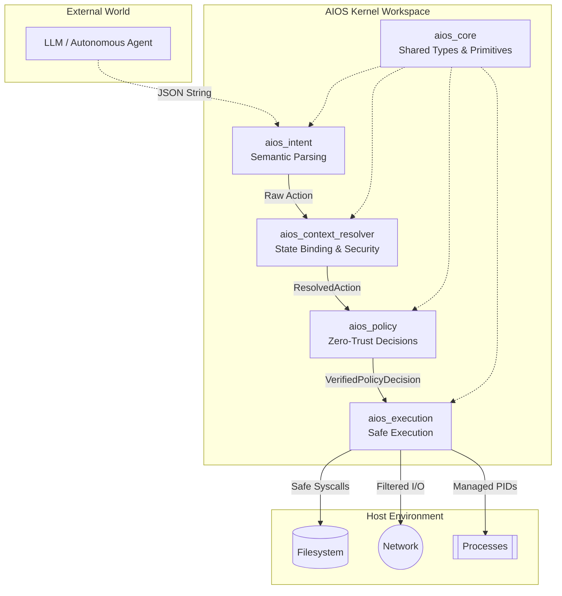

# AIOS Kernel (Artificial Intelligence Operating System)

Welcome to the AIOS Kernel workspace. AIOS is a deterministic, security-first, zero-trust execution environment designed specifically to sandbox, validate, and execute actions generated by Large Language Models (LLMs) or autonomous agents.

Unlike traditional operating systems that rely on identity-based access control, AIOS treats the LLM (the "Agent") as a fundamentally untrusted entity capable of generating hallucinated, malicious, or poorly-formed instructions. AIOS sits between the LLM's brain and the host system, ensuring absolute containment and deterministic execution.

## System Architecture

The AIOS Kernel is composed of five distinct crates, each acting as a hardened layer in a unidirectional data flow pipeline. An action must run the gauntlet through all layers before it is ever executed on the host.



### Layer Breakdown

1. **`aios_intent`**: The bridge between the probabilistic LLM and the deterministic OS. It parses JSON payloads, validates schema compliance, limits payload sizes, prevents JSON-based injection attacks, and maps semantic strings to hardened Rust enums.
2. **`aios_context_resolver`**: The state-binding layer. It translates abstract `Action` objects into `ResolvedAction` objects. It resolves file paths (mitigating TOCTOU attacks via file descriptors), verifies plugin cryptographic signatures, scans for prompt injection indicators, caches system permissions, and maintains short-term agent interaction histories (e.g., detecting spam/loops).
3. **`aios_policy`**: The zero-trust brain. It takes a fully resolved action with its environment context and evaluates it against deterministic rules. It enforces rate limits, checks capability bounds, enforces blacklists, and produces an unforgeable `VerifiedPolicyDecision` token.
4. **`aios_execution`**: The actuation arm. It is the *only* crate with the authority to mutate host state. It consumes the `VerifiedPolicyDecision` token, applies resource locks (to prevent idempotency races), and executes the system call, strictly adhering to the boundaries proven by the resolver and policy engine.
5. **`aios_core`**: The foundational library housing the domain model (`Action`, `RiskLevel`, `Resource`, `TrustLevel`), cryptography primitives, and shared traits.

## Security Mandate

AIOS is built under a strict security mandate:
- **Fail-Closed**: Any anomaly, timeout, or unrecognized state results in immediate denial.
- **Unforgeable Tokens**: System execution requires a cryptographic or strictly type-enforced token representing a policy approval. The execution engine cannot be called directly.
- **No Symlink Races**: All filesystem operations use file-descriptor-based paths (`openat`, `/proc/self/fd/N`) to eliminate Time-Of-Check to Time-Of-Use (TOCTOU) vulnerabilities.
- **Stateless Verification**: Every action is evaluated independently based on its own merits and the current state of the system, though short-term history is kept strictly for anti-spam.
- **Strict Capabilities**: Agents must possess the specific capability (`fs:read`, `net:connect`, `sys:reboot`) required for the action, mapped locally.

## Getting Started

1. Ensure you have Rust and Cargo installed (edition 2021).
2. For Unix environments, `inotify` (Linux) or `kqueue` (macOS) dependencies will be utilized for optimal cache invalidation.
3. Use `cargo build --workspace` to build all layers of the OS.

```bash
cargo check --workspace
cargo test --workspace
```
