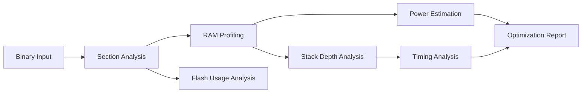

# AIOS Bible — Domains
## Embedded — 003: Resource Constraints

| Property | Value |
|----------|-------|
| Status | Active |
| Version | 1.0.0 |
| Category | Bible — Domains |
| Document ID | AIOS-BBL-007-EMB-003 |
| Source Laws | Law 4 — Law of Evidence, Law 7 — Law of Capability Bounds |
| Source Physics | Physics/005-Events.md, Physics/007-Capabilities.md, Physics/010-Execution.md |
| Supersedes | Nothing |
| Superseded By | Nothing |
| Amended By | RFC |

## Purpose

Analyze embedded firmware binaries for resource constraint compliance across flash, RAM, stack depth, power, and timing, producing optimization recommendations that keep builds within device capability bounds.

## Architecture



The binary input is first dissected into ELF sections. Flash analysis measures code and read-only data footprint. RAM profiling tracks BSS, data, heap, and stack allocations. Stack depth analysis performs static call-graph walks. Power estimation combines peripheral activity with clock tree data. Timing analysis identifies critical paths. All results feed into the optimization recommendation engine.

## Data Model (TypeScript)

```typescript
interface FlashUsageReport {
  totalFlash: number;
  usedFlash: number;
  freeFlash: number;
  usagePercent: number;
  sections: FlashSection[];
  largestFunctions: FunctionFootprint[];
  unreachableCode: number;
}

interface FlashSection {
  name: string;
  size: number;
  address: number;
  type: '.text' | '.rodata' | '.init' | '.fini' | '.ARM.exidx';
  compressionRatio?: number;
}

interface FunctionFootprint {
  name: string;
  size: number;
  file: string;
  inlined: boolean;
}

interface RAMProfile {
  totalRAM: number;
  usedRAM: number;
  freeRAM: number;
  usagePercent: number;
  bssSize: number;
  dataSize: number;
  heapSize: number;
  stackSize: number;
  peakUsage: number;
  allocations: RAMAllocation[];
  fragmentationIndex: number;
}

interface RAMAllocation {
  symbol: string;
  size: number;
  section: '.bss' | '.data' | '.heap' | '.stack';
  alignment: number;
  file: string;
}

interface StackDepthAnalysis {
  totalStack: number;
  worstCaseDepth: number;
  margin: number;
  marginPercent: number;
  callChains: CallChain[];
  recursionDetected: boolean;
  maxRecursionDepth: number;
}

interface CallChain {
  depth: number;
  functions: string[];
  totalSize: number;
  confidence: 'high' | 'medium' | 'low';
}

interface PowerEstimate {
  activeCurrent: number;
  sleepCurrent: number;
  averageCurrent: number;
  voltage: number;
  activePower: number;
  sleepPower: number;
  averagePower: number;
  energyPerCycle: number;
  contributors: PowerContributor[];
  batteryLife?: BatteryEstimate;
}

interface PowerContributor {
  peripheral: string;
  activeMa: number;
  sleepMa: number;
  dutyCycle: number;
  percentageOfTotal: number;
}

interface BatteryEstimate {
  capacityMah: number;
  estimatedHours: number;
  chemistry: 'li-ion' | 'niMH' | 'alkaline' | 'lipo';
  selfDischargePerDay: number;
}

interface TimingReport {
  sysclk: number;
  criticalPaths: CriticalPath[];
  totalWcet: number;
  deadlineMet: boolean;
  slack: number;
}

interface CriticalPath {
  path: string[];
  cycles: number;
  timeUs: number;
  source: string;
  interruptNesting: boolean;
}

interface OptimizationRecommendation {
  priority: 'critical' | 'high' | 'medium' | 'low';
  category: 'flash' | 'ram' | 'stack' | 'power' | 'timing';
  description: string;
  estimatedSaving: OptimizationSaving;
  effort: 'low' | 'medium' | 'high';
  autoFixable: boolean;
  suggestedAction: string;
}

interface OptimizationSaving {
  type: 'bytes' | 'percent' | 'uA' | 'cycles';
  value: number;
  unit: string;
}

interface ConstraintViolation {
  constraint: string;
  actual: number;
  limit: number;
  excess: number;
  category: 'flash' | 'ram' | 'stack' | 'power' | 'timing';
  severity: 'error' | 'warning';
}

interface ConstraintBudget {
  flashLimit: number;
  ramLimit: number;
  stackLimit: number;
  powerLimit: number;
  timingLimit: number;
}
```

## Core Concepts / Operations

| Concept | Operation | Description |
|---------|-----------|-------------|
| Flash Analysis | analyze_flash | Measure code and read-only data footprint from ELF sections |
| RAM Profiling | profile_ram | Track BSS, data, heap, and stack allocation sizes |
| Stack Analysis | analyze_stack | Compute worst-case call depth via static call graph traversal |
| Power Estimation | estimate_power | Model active and sleep current from peripheral duty cycles |
| Timing Analysis | analyze_timing | Identify critical path WCET and slack relative to deadlines |
| Optimization | recommend_optimizations | Generate ranked list of constraint-reducing suggestions |

## Internal Interfaces

```typescript
interface ConstraintAnalyzerAPI {
  analyze_flash(binaryPath: string): Result<FlashUsageReport>;
  profile_ram(binaryPath: string): Result<RAMProfile>;
  analyze_stack(binaryPath: string, callGraph: CallGraph): Result<StackDepthAnalysis>;
  estimate_power(binaryPath: string, profile: BoardProfile): Result<PowerEstimate>;
  analyze_timing(binaryPath: string, clockConfig: ClockConfig): Result<TimingReport>;
  recommend_optimizations(reports: CombinedReports): Result<OptimizationRecommendation[]>;
}

interface CallGraph {
  nodes: CallGraphNode[];
  edges: CallGraphEdge[];
}

interface CallGraphNode {
  function: string;
  file: string;
  address: number;
  size: number;
  stackFrame: number;
  isRecursive: boolean;
}

interface CallGraphEdge {
  caller: string;
  callee: string;
  callsite: string;
  conditional: boolean;
  loopBound?: number;
}

interface CombinedReports {
  flash: FlashUsageReport;
  ram: RAMProfile;
  stack: StackDepthAnalysis;
  power: PowerEstimate;
  timing: TimingReport;
  budget: ConstraintBudget;
}

interface ConstraintValidator {
  check_all(reports: CombinedReports): Result<ConstraintViolation[]>;
  check_constraint(name: string, value: number, limit: number): ConstraintViolation | null;
}

interface OptimizationEngine {
  generate_recommendations(reports: CombinedReports): OptimizationRecommendation[];
  apply_auto_fix(recommendation: OptimizationRecommendation, project: FirmwareProject): Result<FirmwareProject>;
  estimate_savings(recommendation: OptimizationRecommendation): OptimizationSaving;
}
```

## Events

| EMB.EventType | Produced When | Fields |
|-----------|---------------|--------|
| Embedded.FlashAnalyzed | Flash usage analysis completes | binaryId, usedFlash, totalFlash, utilizationPct |
| Embedded.RAMProfiled | RAM profiling completes | binaryId, peakUsage, totalRam, heapFragmentation |
| Embedded.StackDepthChecked | Stack depth analysis completes | binaryId, maxDepth, confidence, callChainDepth |
| Embedded.PowerEstimated | Power consumption estimation completes | binaryId, averageMa, batteryHours, operatingMode |
| Embedded.TimingAnalyzed | Timing analysis completes | binaryId, slack, deadlineMet, criticalPath |
| Embedded.ConstraintViolation | One or more resource constraints are exceeded | binaryId, violations, category, severity |
| Embedded.OptimizationApplied | An auto-fix optimization is applied to the project | binaryId, savingBytes, autoFixCount, recommendations |

## Error Cases

| Code | Condition | Severity | Recovery |
|------|-----------|----------|---------|
| EMB-CON-001 | Analysis tool failure due to missing ELF or corrupted binary | error | Verify binary integrity and re-run extraction pipeline |
| EMB-CON-002 | Missing debug symbols preventing stack depth analysis | error | Rebuild with debug symbols enabled or supply DWARF metadata |
| EMB-CON-003 | Stack overflow detected where worst-case depth exceeds allocated stack | error | Increase stack allocation or refactor deep call chains |
| EMB-CON-004 | Power model mismatch between estimated and measured values exceeds threshold | warning | Calibrate power model coefficients against hardware measurements |
| EMB-CON-005 | Flash utilization exceeds 100 percent of device capacity | error | Reduce application footprint or select a larger flash device |
| EMB-CON-006 | RAM fragmentation index indicates potential allocation failure | warning | Reorder allocation strategy or increase heap size |
| EMB-CON-007 | Timing deadline missed with negative slack on critical path | error | Optimize critical path functions or increase clock frequency |

## Invariants

| ID | Rule | Enforcement |
|----|------|-------------|
| EMB-CON-INV-001 | Flash usage must never exceed the device flash limit defined in the MCU profile | Build pipeline rejects binaries exceeding FlashUsageReport.usedFlash > flashLimit |
| EMB-CON-INV-002 | RAM usage must never exceed the device RAM limit | RAM profiling assertion fails the build if peakUsage > ramLimit |
| EMB-CON-INV-003 | Stack depth analysis must complete with high confidence before deployment | Call chain confidence must be 'high' for all paths in release builds |
| EMB-CON-INV-004 | Power budget must be satisfied across all operating modes | estimate_power returns error if averagePower exceeds powerLimit |
| EMB-CON-INV-005 | Timing slack must be non-negative for all critical paths identified | analyze_timing reports violation if slack < 0 |
| EMB-CON-INV-006 | All optimization recommendations must include an estimated saving | Engine rejects recommendations with null or zero estimatedSaving |

## Design DNA (R1-R6,R9,R10,R13-R15)

| Rule | Application |
|------|-------------|
| R1 — Target Bounded | All constraint analysis is bounded by the target MCU profile's flash, RAM, clock, and power limits |
| R2 — Interchangeable Architecture | Constraint budgets can be swapped by changing the target profile without altering the analysis engine |
| R3 — Generic Operations | Flash, RAM, stack, power, and timing analysis follow the same pipeline for all binary formats |
| R4 — Composition over Inheritance | Reports are composed from independent analyses rather than subclassed from a base report |
| R5 — Stable Intermediate Representation | CombinedReports is the canonical IR passed between analysis stages and into optimization |
| R6 — Temporal Synchronization | Events fire after each analysis completes; optimization waits for all five reports |
| R9 — Stateless Verification | Constraint checks produce identical violations for the same binary and budget every time |
| R10 — Capability-Based Routing | Optimization recommendations are ranked by impact relative to the specific device's capability bounds |
| R13 — Event-Driven Consistency | ConstraintViolation events trigger automatic rollback or alternative generation passes |
| R14 — Code as Law | Constraint budgets are enforced programmatically; no manual overrides bypass analysis |
| R15 — Provably Deterministic | MD5 of binary + budget matches MD5 of all reports across all runs |


## Cross-Cutting Concerns

### Security

Embedded operates under Law 8 (Verification-First) and Law 7 (Capability Bounds): every operation is authorized by the Security Kernel before execution, and the component never exceeds its declared capabilities. (Physics/008-Security.md)

### Evidence

Per Law 4 (Evidence), Embedded emits an evidence record for each significant state change - what changed, by whom, on what basis, with what outcome - delivered through ACF and persisted by EVS. (Physics/005-Events.md)

### Lifecycle

Per Law 6 (Lifecycle Compliance), Embedded instances follow the canonical LMS lifecycle (Draft -> Active -> Suspended -> Archived) and are terminated deterministically; orphan states are prevented. (Physics/006-Lifecycles.md)

### Capability Bounds

Per Law 7 (Capability Bounds), Embedded declares its capabilities at creation and operates only within them; capability expansion requires reauthorization through the Security Kernel. (Physics/007-Capabilities.md)

## Related Documents

| Document | Relationship |
|----------|-------------|
| Bible/0000-Master-Architecture-Plan.md | Master Architecture Plan — constraint analysis in AIOS context |
| Bible/07-Domains/Embedded/000-Overview.md | Base Embedded domain overview |
| Bible/07-Domains/Embedded/001-Devices.md | Device profiles provide resource budgets for constraint checking |
| Bible/07-Domains/Embedded/002-Firmware.md | Firmware generator produces the binaries that constraint analysis validates |
| Bible/06-Services/ACF/000-Overview.md | ACF — analysis event transport |
| Bible/08-Interfaces/SDK/003-Provider-SDK.md | Provider SDK — analysis tool adapter interface |
